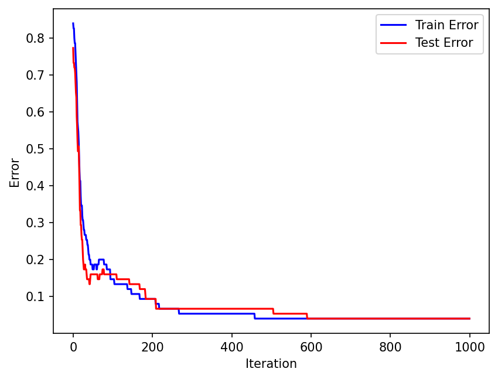
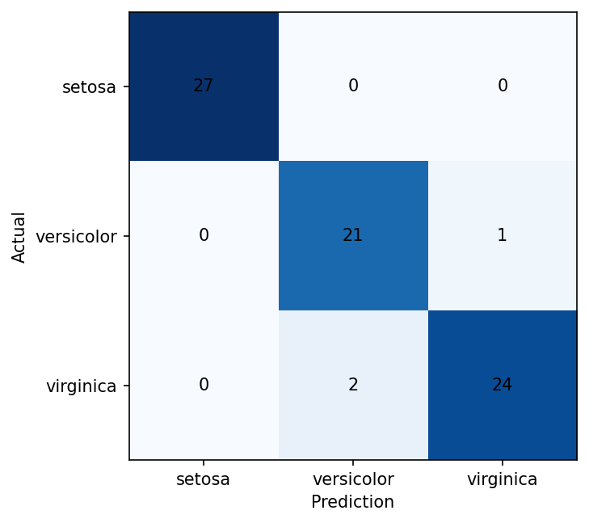
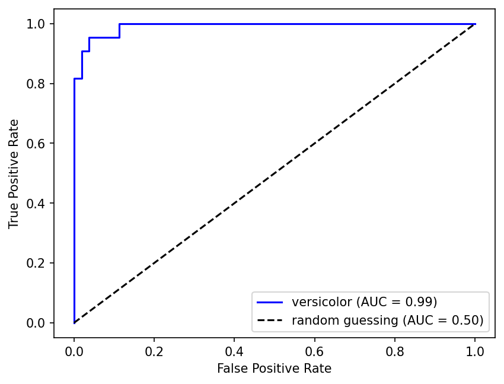
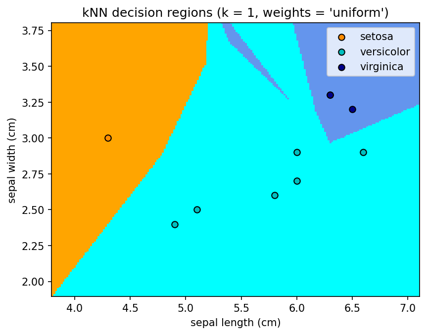
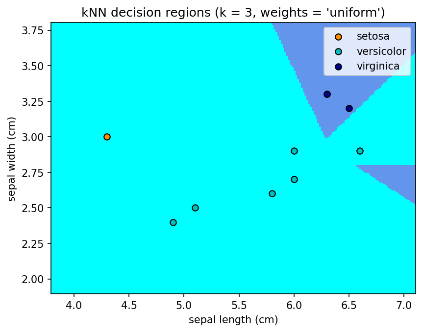
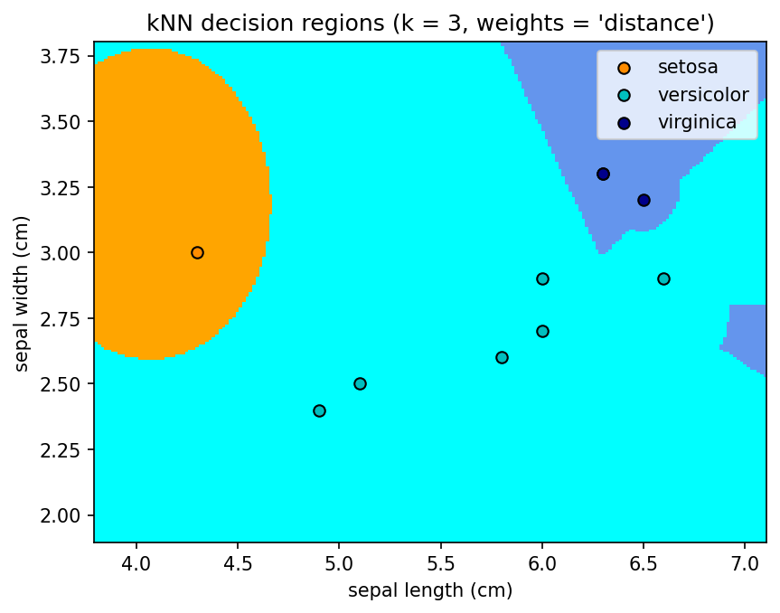

# Logistic Regression

Assume we have a binary classification problem. We aim to fit an $h$ to a data set $S=\{(x_i,y_i)|i \in [m]\}$ that consists of $(x,y)$ pairs with $y \in \{0,1\}$. 

As in the previous lecture, we choose the hypothesis to be a linear function of the input: 

$$\mathcal{H} := \{h: h(x) = w^\top x,~ w \in \mathbb{R}^d \}.$$

For notational convenience, let us ignore the bias term as one can always append a constant one to the input vector $x$ to account for the bias.

The difference of the current setting is that the output space is discrete. Let us interpret the output of our hypothesis, the **score** $z_i := w^\top x_i$, as follows:

 * Its sign indicates the class label. If $z_i > 0$, then the hypothesis predicts that $x_i$ belongs to class $1$. If $z_i < 0$, then the hypothesis predicts that $x_i$ belongs to class $0$.
 * Its magnitude $|z_i|$ indicates the confidence of the hypothesis about the class assignment.

When interpreted this way, $z_i$ is called the **discriminant function** (in Chapter 8 the same quantity reappears, under the same symbol, as the pre-activation of a neuron). While readily usable in its current shape, such a model is not easy to train: the prediction depends on the *sign* of $z_i$, which is not differentiable with respect to the parameters $w$, so no gradient-based method can tune them. The repair is to re-express the hypothesis as a probability — a differentiable quantity — while keeping the score's sign-and-magnitude reading intact. Let $P_i := P(y_i{=}1 \mid x_i)$ denote the probability that $x_i$ belongs to class $1$.

The question is *which* function of $P_i$ the score should equal. Equating $z_i$ with $P_i$ itself cannot work: a probability lives in $(0,1)$, while the score ranges over all of $\mathbb{R}$. What the score's reading does suggest is a continuous quantity that measures how probable class $1$ is *relative to* class $0$. The natural candidate is the **odds** $\dfrac{P_i}{1-P_i}$: it equals $1$ when the two classes are equally likely, grows above $1$ as class $1$ becomes the more probable, and shrinks below $1$ as class $0$ does. Taken as the score's scale, however, the odds treat the two sides of $P_i=\frac12$ unevenly, without any reason to prefer one class over the other: for $P_i<\frac12$ they are squeezed into the bounded interval $(0,1)$, while for $P_i>\frac12$ they stretch over all of $(1,\infty)$, so mirrored probabilities yield *reciprocal* odds rather than *opposite* ones — $P_i=0.9$ gives odds $9$, whereas $P_i=0.1$ gives $\frac19$. The score, by contrast, is symmetric about zero: exchanging the roles of the two classes should merely negate it. The logarithm repairs exactly this asymmetry: the **log odds** $\log\dfrac{P_i}{1-P_i}$ is $0$ at $P_i=\frac12$, takes mirrored values at mirrored probabilities ($\log 9=-\log\frac19$), and ranges over all of $\mathbb{R}$ — a scale symmetric about zero, on a par with the score. Equating the score with the log odds yields:

$$\log \dfrac{P_i}{1-P_i} = w^\top x_i.$$

Let us solve for $P_i$ stepwise:

$$
\begin{aligned} 
&\dfrac{P_i}{1-P_i} = e^{w^\top x_i}\\
&\Rightarrow P_i = e^{w^\top x_i} - P_i e^{w^\top x_i}\\
&\Rightarrow P_i + P_i e^{w^\top x_i} = e^{w^\top x_i}\\
&\Rightarrow P_i (1 + e^{w^\top x_i}) = e^{w^\top x_i}\\
&\Rightarrow P_i = \dfrac{e^{w^\top x_i}}{1 + e^{w^\top x_i}}\\
&\Rightarrow P_i = \dfrac{e^{w^\top x_i} e^{-w^\top x_i}}{(1 + e^{w^\top x_i})e^{-w^\top x_i}}\\
&\Rightarrow P_i = \dfrac{1}{1 + e^{-w^\top x_i}}.
\end{aligned}
$$

The result $g(u) =  \dfrac{1}{1 + e^{-u}}$ has the form of a function known as the **sigmoid function**. The expression $\log (P_i/(1-P_i))$ is sometimes called the **log odds** or the **logit function**. It is the inverse of the sigmoid function: $g^{-1}(P) = \log (P/(1-P))$ for some probability $P$. When $u := w^\top x_i$, the model is called **logistic regression** [Cox (1958)](https://www.jstor.org/stable/2983890)<!-- cite: cox1958logistic | article | author={Cox, D. R.}; title={The Regression Analysis of Binary Sequences}; journal={Journal of the Royal Statistical Society: Series B}; year={1958}; volume={20}; number={2}; pages={215--242} -->. Note what the construction achieved: the sign of the score still carries the prediction — $g(u)\ge\frac12$ exactly when $u\ge0$, since $g$ is strictly increasing with $g(0)=\frac12$ — and the magnitude of the score still carries confidence, now as distance from the decision boundary $\frac12$ on the probability scale, and every bit of it is differentiable in $w$.

We would like our hypothesis to maximize the true class probability of all data points in the data set. Since we assume our data points to be independent, the probability of the data set is the product of the probabilities of each data point, and maximizing it point by point maximizes it jointly:

$$\prod_{i=1}^m P_i^{y_i} (1-P_i)^{1-y_i}.$$

Maximizing this product is mathematically equivalent to maximizing its logarithm, since $\log$ is strictly increasing. The logarithm is also what makes the objective usable, for two reasons. First, *numerical precision*: the product of many probabilities, each below $1$, shrinks towards zero exponentially fast in $m$ — a million data points of probability around $0.5$ multiply to about $10^{-301030}$, far below what any computer can represent — and once a product underflows, comparing candidate parameters becomes impossible. The logarithm converts the product into a *sum*, which grows linearly in $m$ instead of shrinking exponentially, and stays within representable range. Second, *optimization*: sums split over data points, so the objective and its gradient decompose into per-point contributions — a structure gradient descent (and the mini-batching of Chapter 8) relies on — and the exponent in each factor, $P_i^{y_i}(1-P_i)^{1-y_i}$, comes down from the power to a multiplier, where $P_i = g(w^\top x_i)$ and $g$ itself already involves an exponential. Hence, we can define the **binary cross-entropy loss** as the negated log-probability of the data set:

$$\mathcal{L}_{CE}(w) = -\sum_{i=1}^m \log g(w^\top x_i)^{y_i} (1-g(w^\top x_i))^{1-y_i} = -\sum_{i=1}^m \Big[ y_i \log g(w^\top x_i) + (1-y_i) \log(1-g(w^\top x_i)) \Big].$$

## Extension to multi-class classification

Let us quickly extend the above formulation to multi-class classification. Assume we have $C$ classes, that is, we aim to fit an $h$ to a data set $S=\{(x_i,y_i)|i \in [m]\}$ that consists of $(x,y)$ pairs with $y \in \{1,\ldots, C\}$. We will then need to model the class probabilities of $C$ different classes, $P_1, \ldots, P_C$, from $C$ per-class scores $u_c := w_c^\top x_i$. The binary construction generalizes directly: the log odds $\log\frac{P}{1-P}$ measures how probable a class is relative to *one specific other class*, so with $C$ classes we pick one of them — call it class $j\in[C]$ — as the **baseline**, and let each score $u_c$ measure class $c$ against that baseline:

$$\log \dfrac{P_c}{P_j} = u_c = w_c^\top x_i, \qquad c \neq j .$$

Let us solve for the class probabilities step by step.

*Step 1: exponentiate each equation.* For every class $c\neq j$,

$$\dfrac{P_c}{P_j} = e^{u_c} \quad\Longrightarrow\quad P_c = P_j\, e^{u_c}.$$

The baseline's own equation is trivially $\log\frac{P_j}{P_j}=0$, so class $j$ has no score of its own — it is the reference against which the others are measured, and its "exponent" is $e^0=1$.

*Step 2: determine $P_j$ from normalization.* The probabilities must sum to one. Substituting $P_c = P_je^{u_c}$ for every $c\neq j$:

$$1 = \sum_{c=1}^{C} P_c = P_j + \sum_{c\neq j} P_j\,e^{u_c} = P_j\Big(1 + \sum_{c\neq j} e^{u_c}\Big) = P_j \sum_{c=1}^{C} e^{u_c},$$

where the last equality uses $1=e^{u_j}$ with $u_j:=0$. Hence

$$P_j = \dfrac{1}{\sum_{c'=1}^{C} e^{u_{c'}}}.$$

*Step 3: back-substitute.* Combining $P_c = P_je^{u_c}$ with the expression for $P_j$ gives every class probability at once:

$$P_c = \dfrac{e^{u_c}}{\sum_{c'=1}^{C} e^{u_{c'}}} =: \mathrm{softmax}(u)_c ,$$

which is called the **softmax** function. Note that the choice of the baseline class has effectively disappeared from the result: picking a different class $j'$ as the baseline shifts every score by a constant ($u_c' = u_c - u_{j'}$, leaving the ratios $e^{u_c}/e^{u_{c'}}$ untouched), so the softmax depends only on the *differences* between the scores — with $C=2$ it reduces to the sigmoid of exactly that difference, $P_{\bar\jmath} = g(u_{\bar\jmath}-u_j)$ for the one non-baseline class $\bar\jmath$. For the very same reason we may drop the bookkeeping convention $u_j=0$ altogether and simply give **every** class its own score $u_c = w_c^\top x_i$, one weight vector per class: a common shift of all scores changes no probability, so the redundancy is harmless, and this is the convention used in the loss below. The related loss function is then:

$$\mathcal{L}_{CE}(W) = -\sum_{i=1}^m \log \mathrm{softmax}(u_i)_{y_i} = \sum_{i=1}^m \Big \{ -w_{y_i}^\top x_i + \log \Big ( \sum_{c=1}^C e^{w_c^\top x_i} \Big )  \Big \},$$

where $u_i := (w_1^\top x_i, \ldots, w_C^\top x_i)$ and $W = [w_1 \ldots w_C]$ is a matrix of the weight vectors for each class. This loss function is called the **cross-entropy loss**. The name is inherited from information theory, where the very same expression appears as a measure of the disagreement between two probability distributions; anticipating the probability chapter, the intuitive reading is enough for now: since $\mathrm{softmax}(u_i)_{y_i}$ is the probability the model assigns to the correct label of $x_i$, the loss is the *negative logarithm* of the model's probability of the observed data — minimizing it means making the observed labels as probable as possible. (Its information-theoretic content will resurface in Chapter 7, where the closely related notion of entropy is used to grow decision trees.)

Let us take the well-known **Iris** data set as an example. Our task is to classify the iris flowers into three species. The data set is available in the sklearn library. The data set consists of 150 data points. Each data point has four features: sepal length, sepal width, petal length, and petal width. The data points are labeled as one of the three species: i) setosa, ii) versicolor, and iii) virginica. The data set is balanced: There are 50 data points for each species.

```python
from sklearn.datasets import load_iris
import matplotlib.pyplot as plt
import torch as th

th.manual_seed(0)

# The only library-provided piece is the raw data set itself; the split and
# every step of the classifier are implemented below.
X_all, y_all = load_iris(return_X_y=True)
X_all = th.tensor(X_all).float()
y_all = th.tensor(y_all).long()

perm = th.randperm(X_all.shape[0])
n_train = X_all.shape[0] // 2
X_train, y_train = X_all[perm[:n_train]], y_all[perm[:n_train]]
X_test, y_test = X_all[perm[n_train:]], y_all[perm[n_train:]]
```

Let us put together what we learned thus far to make up an algorithm that is as general as possible. Concretely, let us use the cross-entropy loss for empirical risk minimization and an $L_p$ regularizer with tunable $p$ to control the complexity of the model. The resulting optimization problem is:

$$\mathcal{L}(W) := \mathcal{L}_{CE}(W) + \lambda \sum_{c=1}^C  ||w_c||_p^p.$$

We minimize it by gradient descent, exactly as for the Lasso in Chapter 2: the softmax cross-entropy is written out in the form derived above — a difference of one log-sum and a second log-sum over the exponentials of the per-class scores, hence its usual name, the **log-sum-exp** form — automatic differentiation supplies $\nabla_W \mathcal{L}(W)$, and the update rule is coded by hand.

```python
class GeneralizedLinearClassifier:
    def __init__(self, n_dims, n_classes=3, lambda_coef=1.0, p=2):
        self.lambda_coef, self.p = lambda_coef, p
        self.W = th.randn(n_dims, n_classes).requires_grad_()
        self.b = th.randn(n_classes).requires_grad_()

    def predict(self, inputs):
        return inputs @ self.W + self.b        # the C per-class logits u_c

    def cross_entropy(self, logits, labels):
        # -log softmax(u)_y = -u_y + log sum_c exp(u_c), exactly the loss
        # derived above. The row maximum is subtracted before exponentiating
        # so that exp() cannot overflow; it cancels out of the difference.
        shift = logits.max(dim=1, keepdim=True).values
        log_norm = shift.squeeze(1) + (logits - shift).exp().sum(dim=1).log()
        return (log_norm - logits.gather(1, labels.view(-1, 1)).squeeze(1)).mean()

    def learn(self, inputs, labels, alpha=0.1, num_steps=1):
        for _ in range(num_steps):
            # Forward pass: cross-entropy risk plus the L_p regularizer
            loss = self.cross_entropy(self.predict(inputs), labels) \
                   + self.lambda_coef * (self.W.abs()**self.p).sum()
            # Backward pass: automatic differentiation fills W.grad and b.grad
            loss.backward()
            # The gradient descent step, written out explicitly
            with th.no_grad():
                for param in (self.W, self.b):
                    param -= alpha * param.grad
                    param.grad.zero_()
```

Let us train our model next and plot its learning curve, i.e. the evolution of its error across iterations.

```python
# z-score normalization, with mu and sigma taken from the training split only
mu = X_train.mean(dim=0)
sd = X_train.std(dim=0, unbiased=False)
X_train = (X_train - mu) / sd
X_test = (X_test - mu) / sd

model_glc = GeneralizedLinearClassifier(n_dims=X_train.shape[1],
                                        lambda_coef=0.01, p=2)
num_iterations = 1000
train_errors = th.zeros(num_iterations)
test_errors = th.zeros(num_iterations)

for ii in range(num_iterations):
    model_glc.learn(X_train, y_train)
    with th.no_grad():
        pred_class = model_glc.predict(X_train).argmax(dim=1)
        train_errors[ii] = (pred_class != y_train).float().mean()
        pred_class = model_glc.predict(X_test).argmax(dim=1)
        test_errors[ii] = (pred_class != y_test).float().mean()

plt.plot(th.arange(num_iterations), train_errors, 'b-', label="Train Error")
plt.plot(th.arange(num_iterations), test_errors, 'r-', label="Test Error")
plt.xlabel("Iteration"); plt.ylabel("Error"); plt.legend(loc="upper right")
plt.show()
```



# Performance Metrics for Classification

The goal of classification is to recognize a pattern, e.g. an object. From the viewpoint of a single object type, there can be four different outcomes of a classification task:

 * True Positive (TP): The object is correctly classified as positive.
 * False Positive (FP): The object is incorrectly classified as positive.
 * True Negative (TN): The object is correctly classified as negative.
 * False Negative (FN): The object is incorrectly classified as negative.

Let us make a matrix of these possible outcomes as a latex table:

|                     | **Predicted Positive** | **Predicted Negative** |
|---------------------|------------------------|------------------------|
| **Actual Positive** | TP                     | FN                     |
| **Actual Negative** | FP                     | TN                     |

The version of this table where its entries are filled with the number of data points that fall into each category is called a **confusion matrix**. We can compute many performance metrics from the confusion matrix: 

  1. **Accuracy**: (TP + TN) / (TP + FP + TN + FN), the ratio of the number of correctly classified objects to the total number of objects.
  2. **Precision**: TP / (TP + FP), the ratio of the number of correctly classified objects to the number of objects classified as the object type.
  3. **Recall** (a.k.a. **True Positive Rate**, **Sensitivity**): TP / (TP + FN), the ratio of the number of correctly classified objects to the number of objects that are actually of the object type.
  4. **F1 score**: 2 $\times$ Precision $\times$ Recall / (Precision + Recall), the harmonic mean of the precision and the recall.
  5. **False Positive Rate**: FP / (FP + TN), the ratio of the number of objects that are not of the object type but classified as the object type to the total number of objects that are not of the object type.

  The rationale behind the F1 score is that precision and recall are rates. Harmonic mean is a more sensible score to take the average of multiple rates. Consider a car that travels a distance $d$ with speed $x$ and returns with speed $y$. The average speed of the whole travel is

  $$\frac{2d}{\frac{d}{x}+\frac{d}{y}} = \frac{2}{\frac{1}{x}+\frac{1}{y}}$$

  which is the harmonic mean of $x$ and $y$. In words, harmonic mean is the reciprocal of the average of the reciprocals of a set of quantities.

  One can calculate the confusion matrix also for more than two classes. Let us see what it looks like for the Iris data set.

```python
with th.no_grad():
    pred_class = model_glc.predict(X_test).argmax(dim=1)

C = 3
# cm[a, p] counts the test points with actual label a and prediction p
cm = th.bincount(y_test * C + pred_class, minlength=C * C).reshape(C, C)
print(cm)

names = ['setosa', 'versicolor', 'virginica']
fig, ax = plt.subplots()
ax.imshow(cm, cmap='Blues')
for a in range(C):
    for p in range(C):
        ax.text(p, a, cm[a, p].item(), ha='center', va='center')
ax.set_xticks(range(C), names); ax.set_yticks(range(C), names)
ax.set_xlabel("Prediction"); ax.set_ylabel("Actual")
plt.show()
```

    tensor([[27,  0,  0],
            [ 0, 21,  1],
            [ 0,  2, 24]])



Except for accuracy, the other four performance metrics need to be calculated separately for each class. For instance, let us calculate them for versicolor, the class the model finds hardest.

```python
c = 1                                          # versicolor
precision = cm[c, c] / cm[:, c].sum()          # sum towards the column
recall = cm[c, c] / cm[c, :].sum()             # sum towards the row
print("Precision: ", precision.item())
print("Recall: ", recall.item())
print("F1: ", (2 * precision * recall / (precision + recall)).item())
```

    Precision:  0.9130434989929199
    Recall:  0.9545454382896423
    F1:  0.9333332777023315

Another important performance metric is **Receiver Operating Characteristics (ROC)**. It is a plot of the true positive rate (TPR) against the false positive rate (FPR) for all possible thresholds applicable on the discriminant function. The **Area Under the ROC curve (AUC)** is a measure of the performance of the classifier. The higher the AUC, the better the classifier. A perfect classifier has an AUC of 1. A classifier that performs no better than random guessing has an AUC of 0.5.

Let us plot the ROC curve for the Iris data set.

```python
with th.no_grad():
    logits = model_glc.predict(X_test)
    # The class posteriors P_c = softmax(u)_c of the model
    probs = (logits - logits.max(dim=1, keepdim=True).values).exp()
    probs = probs / probs.sum(dim=1, keepdim=True)

# One-vs-rest score for versicolor (class 1) and the matching binary labels
scores = probs[:, 1]
positives = (y_test == 1)

# Sweep the threshold down through the observed scores, in decreasing order,
# and read off TPR and FPR at every position.
order = th.argsort(scores, descending=True)
hits = positives[order].float()
tp = th.cat([th.zeros(1), hits.cumsum(0)])
fp = th.cat([th.zeros(1), (1 - hits).cumsum(0)])
tpr, fpr = tp / tp[-1], fp / fp[-1]
auc = th.trapz(tpr, fpr)              # area under the curve, by trapezoids

plt.figure()
plt.plot(fpr, tpr, 'b-', label="versicolor (AUC = {:.2f})".format(auc))
plt.plot([0, 1], [0, 1], 'k--', label="random guessing (AUC = 0.50)")
plt.xlabel("False Positive Rate"); plt.ylabel("True Positive Rate")
plt.legend(loc="lower right")
plt.show()
```



**Remark.** Accuracy is a meaningful performance metric only when the classes are evenly distributed. The cases when the classes are not evenly distributed are called **imbalanced classification problems**. In such cases, we need to use other metrics such as precision, recall, and F1 score.

---

# K-Fold Cross Validation

As is noticeable in the above example, the observed performance may depend greatly on the particular train-test split. To mitigate this problem, we can use **K-fold cross validation**. The idea is to split the data set into $K$ folds. Then, we train the model on $K-1$ folds and test it on the remaining fold. We repeat this process $K$ times, each time using a different fold as the test set. The final performance metric is the average of the performance metrics obtained in each iteration.

# K-Nearest Neighbors (kNN) Classifier

The **k-nearest neighbors** [Fix and Hodges (1951)](https://doi.org/10.2307/1403797)<!-- cite: fix1951nearest | techreport | author={Fix, Evelyn and Hodges, Joseph L.}; title={Discriminatory Analysis, Nonparametric Discrimination: Consistency Properties}; institution={USAF School of Aviation Medicine, Randolph Field, Texas}; year={1951} --> classifier assigns a query point to the class of the majority of its $k$ nearest neighbors. It is a **non-parametric classifier**, that is, it does not represent the model with a fixed number of parameters. Instead, it memorizes the whole training data and uses it to make predictions. The number of neighbors $k$ is a hyperparameter of the model. While it is a strong classifier, its prediction-time complexity is unacceptable: $O(m)$, where $m$ is the number of training data points.

One can implement a kNN in various ways. Given a query point $x$, one can find its $k$ nearest neighbors $Ne(x;k) = \{ (x_i, y_i) : [k] \}$ in the training data set and assign $x$ to the class of the majority of its $k$ nearest neighbors:

$$\widehat{y} = \arg \max_{c \in [C]} \sum_{i=1}^k \mathds{1}(y_i = c).$$

One can also assign a weight to each neighbor inversely proportional to its distance to the query point and assign $x$ to the class of the majority of its $k$ nearest neighbors weighted by the inverse of their distances to $x$.

$$\widehat{y} = \arg \max_{c \in [C]} \sum_{i=1}^k \mathds{1}(y_i = c) \dfrac{1}{\mathrm{dist}(x,x_i)}$$

for some distance function $\mathrm{dist}(\cdot,\cdot)$ on $\mathcal{X}$, i.e. the second component of a metric space $(\mathcal{X}, \mathrm{dist})$ in the sense of Chapter 2 — any such choice makes "nearest" well defined.

The **Voronoi cell** of a point $x$ is the set of points whose nearest neighbor is $x$. The Voronoi cells of the training data points form a partition of the input space. The decision boundary of a 1-nearest neighbor classifier is the set of points that are equidistant to two or more training data points. For general $k$, the decision boundary instead sits where the *majority label* among the $k$ nearest neighbors changes — a subset of the points equidistant between two training points, but not all of them, since moving across such a point need not flip the majority vote. See an illustration from the Iris data set below.

```python
from matplotlib.colors import ListedColormap

# A tiny subsample, so that the individual Voronoi cells stay visible
sub = th.randperm(X_all.shape[0])[:10]
X_knn, y_knn = X_all[sub][:, :2], y_all[sub]

def knn_predict(queries, X, y, k=1, weights="uniform", n_classes=3):
    """Assign each query to the class with the largest (weighted) vote among
    its k nearest training points -- the two rules stated above."""
    d = th.cdist(queries, X)                       # pairwise distances
    dist, idx = d.topk(k, dim=1, largest=False)    # the k nearest neighbours
    w = th.ones_like(dist) if weights == "uniform" else 1.0 / (dist + 1e-12)
    votes = th.zeros(queries.shape[0], n_classes)
    votes.scatter_add_(1, y[idx], w)               # accumulate 1(y_i = c) * w
    return votes.argmax(dim=1)

cmap_light = ListedColormap(["orange", "cyan", "cornflowerblue"])
cmap_bold = ["darkorange", "c", "darkblue"]
names = ['setosa', 'versicolor', 'virginica']

# The mesh on which the decision regions are painted
pad = 0.5
g0 = th.linspace(X_knn[:, 0].min() - pad, X_knn[:, 0].max() + pad, 200)
g1 = th.linspace(X_knn[:, 1].min() - pad, X_knn[:, 1].max() + pad, 200)
gg0, gg1 = th.meshgrid(g0, g1, indexing='xy')
mesh = th.stack([gg0.reshape(-1), gg1.reshape(-1)], dim=1)

def plot_regions(zz, k, weights):
    fig, ax = plt.subplots()
    # vmin/vmax are pinned to the class range: with auto-scaling, a class absent
    # from the predictions (e.g. a setosa point that never wins a 3-vote) would
    # shift the color mapping and paint the remaining classes in the wrong colors.
    ax.pcolormesh(gg0, gg1, zz, cmap=cmap_light, shading="auto", vmin=0, vmax=2)
    for c in range(3):
        pts = X_knn[y_knn == c]
        ax.scatter(pts[:, 0], pts[:, 1], c=cmap_bold[c],
                   edgecolor="black", label=names[c])
    ax.set_xlabel("sepal length (cm)"); ax.set_ylabel("sepal width (cm)")
    ax.legend()
    ax.set_title("kNN decision regions (k = %d, weights = '%s')" % (k, weights))

# With k = 1 the two weighting schemes coincide -- a single neighbor takes
# the whole vote whatever its weight -- and the decision regions are
# exactly the Voronoi cells of the training points.
plot_regions(knn_predict(mesh, X_knn, y_knn, k=1, weights="uniform").reshape(gg0.shape),
             k=1, weights="uniform")

# The weightings disagree only once several neighbors share the vote:
# with uniform weights each of the k neighbors counts equally, with
# distance weights a close neighbor can outvote several farther ones.
for weights in ["uniform", "distance"]:
    plot_regions(knn_predict(mesh, X_knn, y_knn, k=3, weights=weights).reshape(gg0.shape),
                 k=3, weights=weights)

plt.show()
```






